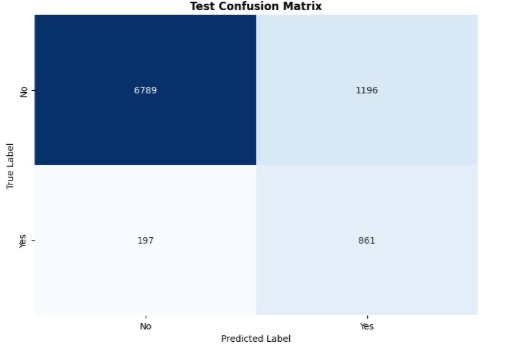
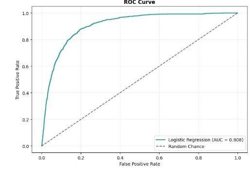
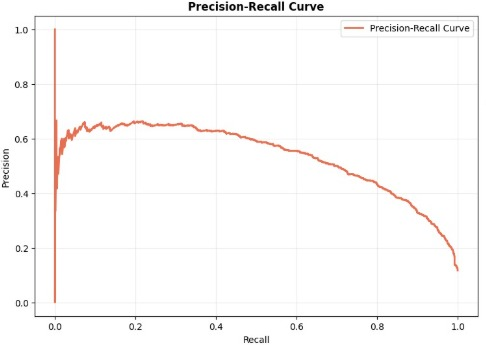
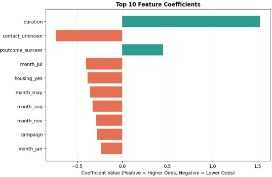
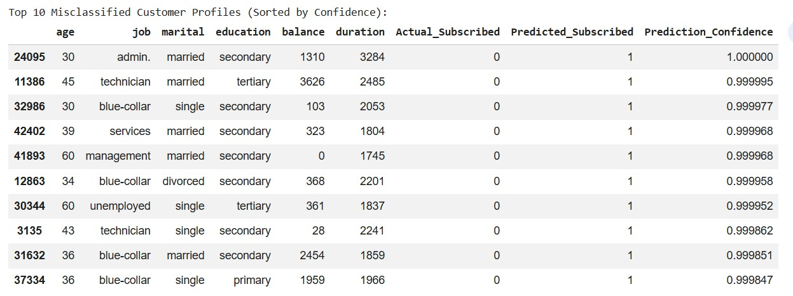

# Bank Term Deposit Subscription Prediction

Logistic regression model that predicts whether a bank customer will subscribe to a term deposit, using the UCI Bank Marketing dataset (`bank-full.csv`, 45,211 rows).

## Project Structure

```
bank_subscription_prediction/
├── source/
│   └── Solution_2.ipynb
├── Diagrams/
│   ├── confusion_matrix.jpeg
│   ├── roc_curve.jpeg
│   ├── precision_recall_curve.jpeg
│   ├── top10_feature_coefficients.jpeg
│   └── top10_misclassified_profiles.jpeg
└── README.md
```

## Dataset

Target column `y` (subscribed or not) mapped to 1/0. Features include age, job, marital status, education, balance, loans, and campaign contact details (month, duration, number of contacts, previous outcome).

## Approach

- One-hot encoded categorical features, 80/20 stratified train-test split, features scaled with `StandardScaler`.
- Trained `LogisticRegression(class_weight="balanced")` to handle the class imbalance (only ~11.7% subscribed).
- Evaluated with accuracy, ROC-AUC, confusion matrix, precision-recall curve, feature coefficients, and a look at misclassified cases.

## Results

| Metric | Score |
|---|---|
| Accuracy | 84.60% |
| ROC-AUC | 0.9079 |
| Precision (Subscribed) | 0.42 |
| Recall (Subscribed) | 0.81 |
| F1-score (Subscribed) | 0.55 |

## Confusion Matrix


## ROC Curve


## Precision-Recall Curve


## Top 10 Feature Coefficients


## Top 10 Misclassified Customer Profiles


## Observations

The model catches most actual subscribers (81% recall) but also flags many false positives (42% precision), and separates the two classes well overall with a ROC-AUC of 0.91. Call duration is the strongest predictor of subscribing, followed by success in a past campaign, while an unknown contact method, certain months, having a housing loan, and more contact attempts are all linked to lower odds. Most of the model's confident mistakes are customers with unusually long calls who still didn't subscribe, showing that call duration, while very predictive, is also the main source of errors.

## Tech Stack

Python, pandas, NumPy, scikit-learn, matplotlib, seaborn, Google Colab

## How to Run

1. Open `source/Solution_2.ipynb` in Colab or Jupyter.
2. Point `ZIP_PATH_IN_DRIVE` to your copy of `bank-data.zip`.
3. Run all cells to reproduce the results and plots.
